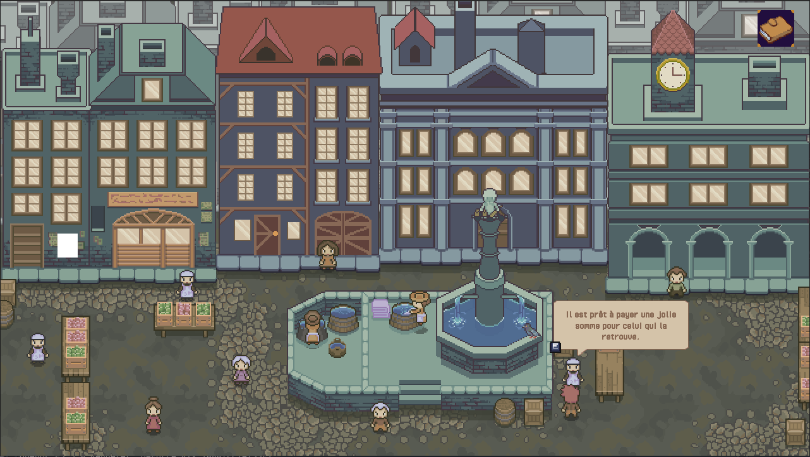

# Lausanne-1830
Open source historically inspired role-playing game based on 1830s Lausanne.  



# Game Design

Jeu vidéo pédagogique qui sera utilisé dans les écoles lausannoises (12-16 ans) ayant pour objectif de retranscrire Lausanne en 1830. Le but du jeu est de compléter le registre de la population et de retrouver les informations manquantes sur cinq personnages habitant Lausanne en 1830 à travers la résolution d'enquêtes.

Pour cela, le joueur ou la joueuse pourra se balader dans plusieurs espaces accessibles par l'intermédiaire d'une carte, à savoir : 
- La place de la palud
- Un moulin du Flon (vue extérieure et vue intérieure)
- L'extérieur du Casino
- L'intérieur de la brasserie Truschel

Educational video game that will be used in schools (12-16yo) to teach the history of Lausanne in 1830. The goal is to complete the given notebook and find missing information about five characters living in Lausanne at the time.
The player can explore different places that can be accessed through the map.

# Dev  

Game currently being developped using the Open-Source [Godot](https://godotengine.org/download) game engine.  
__Godot version__: Godot Mono v3.4-stable  

Requirements:
- OpenGL 3.3 / OpenGL ES 3.0 compatible hardware
- For the Mono version: MSBuild
(from Visual Studio Build Tools or the [Mono SDK](https://www.mono-project.com/download/stable/))

## Input Map  

- __E__: Interact.   
- __Arrow keys / wasd__: Move around.  
- __Hold Shift__: Sprint (for 3 sec then 2 sec cooldown).  
  
## Dialogue File Format  

Dialogue is formatted using XML.  

Example:  

```xml
<scene name="palud">
    <dialogue type="onApproach" id="testApproach" ntargets="1">
        <text>
            <option id="0">Du pain frais de ce matin !</option>
            <option id="1">Venez goûter !</option>
        </text>
    </dialogue>
    <dialogue type="onDemand" id="testDemand" ntargets="1">
        <text>
            <option id="0">Bien le bonjour, qu'est-ce qui vous intéresse ?</option>
            <option id="1">Pain, croissant ?</option>
        </text>
        <text>C'est fait ce matin avec la farine des Rochat !</text>
        <text>Vous devriez aller visiter leur moulin au Flon.</text>
    </dialogue>
</scene>
```  

Here we have the following format:  

- __scene__: defines a scene, contains an attribute __name__ which is the name of the scene.  
- __dialogue__: defines a set of dialogue lines, contains the following attributes:  
    1. __type__: Defines how the dialogue is triggered (either _onDemand_ or _onApproach_).  
    2. __id__: A unique identifier used to locate the dialogue.  
    3. __ntargets__: The number of NPCs in the conversation.   
- __text__: The core text of the dialogue, contains and __id__ defining the index in the dialogue it is at.  
- __option__: In the case of random dialogue, an option is one of the options for a given text, __id__ is the index of the option.  
  


